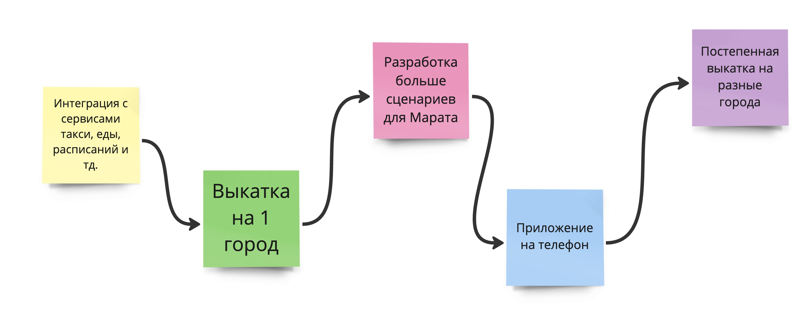

## Марат

Для начала нужно создать `.env.local`:

```
NEXT_PUBLIC_API_KEY= # Base64 clientid:clientsecret for Salut Speech https://developers.sber.ru/portal/products/smartspeech
NEXT_PUBLIC_SALUT_API_ENDPOINT=http://localhost:7778
NEXT_PUBLIC_AUTH_ENDPOINT=http://localhost:7779
NEXT_PUBLIC_YMAP_API_KEY= # Yandex Map API key
NEXT_PUBLIC_GIGA_KEY=# Base64 clientid:clientsecret for https://developers.sber.ru/portal/products/gigachat-api
```
Дальше надо запустить проксю для API. 
Узнать как установить caddy можно найти [тут](https://caddyserver.com/docs/install).

```
caddy run --watch
```


Теперь можно запустить приложение:
```bash
npm i
npm run dev
```

Приложение будт доступно тут: [http://localhost:3000](http://localhost:3000).


Roadmap
